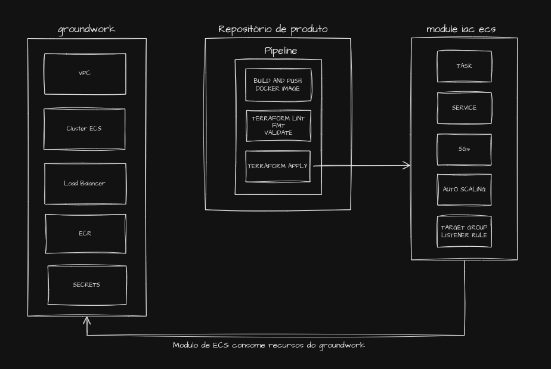

# jhtoigo-ecs-stack
Repositório de groundwork, tem como finalidade criar a infraestrutura básica para subir services do ECS em um cluster ECS Fargate e disponibilizar acesso através de um Aplication Load balancer.

Foram utilizados módulos prórios que podem ser acessados em:

* [VPC](https://github.com/jhtoigo/terraform-aws-vpc.git)
* [Load Balancer](https://github.com/jhtoigo/terraform-aws-load-balancer.git)
* [Cluster ECS Fargate](https://github.com/jhtoigo/terraform-aws-ecs-cluster.git)
* [ECR](https://github.com/jhtoigo/terraform-aws-ecr.git)

## TODO

* Módulo RDS

<!-- BEGIN_TF_DOCS -->
## Requirements

| Name | Version |
|------|---------|
|  [terraform](#requirement\_terraform) | >=1.6.0 |
|  [aws](#requirement\_aws) | >= 5.60 |

## Providers

| Name | Version |
|------|---------|
|  [aws](#provider\_aws) | 5.66.0 |

## Modules

| Name | Source | Version |
|------|--------|---------|
|  [ecr](#module\_ecr) | git::https://github.com/jhtoigo/terraform-aws-ecr.git | v1.0.1 |
|  [ecs](#module\_ecs) | git::https://github.com/jhtoigo/terraform-aws-ecs-cluster.git | v1.1.2 |
|  [load\_balancer](#module\_load\_balancer) | git::https://github.com/jhtoigo/terraform-aws-load-balancer.git | v1.2.0 |
|  [vpc](#module\_vpc) | git::https://github.com/jhtoigo/terraform-aws-vpc.git | v1.3.1 |

## Resources

| Name | Type |
|------|------|
| [aws_secretsmanager_secret.secret](https://registry.terraform.io/providers/hashicorp/aws/latest/docs/resources/secretsmanager_secret) | resource |
| [aws_service_discovery_http_namespace.main](https://registry.terraform.io/providers/hashicorp/aws/latest/docs/resources/service_discovery_http_namespace) | resource |
| [aws_ssm_parameter.sd_namespace_name](https://registry.terraform.io/providers/hashicorp/aws/latest/docs/resources/ssm_parameter) | resource |

## Inputs

| Name | Description | Type | Default | Required |
|------|-------------|------|---------|:--------:|
|  [azs](#input\_azs) | Avaibility Zones | `list(string)` | n/a | yes |
|  [cidr\_block](#input\_cidr\_block) | CIDR Block for VPC | `string` | n/a | yes |
|  [database\_subnets](#input\_database\_subnets) | VPC database Subnets | `list(string)` | n/a | yes |
|  [nat\_gateway\_active](#input\_nat\_gateway\_active) | Enable or not nat Gateways | `bool` | n/a | yes |
|  [private\_subnets](#input\_private\_subnets) | VPC Private Subnets | `list(string)` | n/a | yes |
|  [project\_name](#input\_project\_name) | Project name | `string` | n/a | yes |
|  [public\_subnets](#input\_public\_subnets) | VPC Public Subnets | `list(string)` | n/a | yes |
|  [region](#input\_region) | AWS Region | `string` | n/a | yes |
|  [tags](#input\_tags) | Tags for resources | `map(string)` | n/a | yes |

## Outputs

| Name | Description |
|------|-------------|
|  [ssm\_cluster\_name](#output\_ssm\_cluster\_name) | SSM parameter ECS Cluster Name |
|  [ssm\_database\_subnets\_id](#output\_ssm\_database\_subnets\_id) | SSM parameter IDs to database subnets IDs |
|  [ssm\_ecs\_log\_group](#output\_ssm\_ecs\_log\_group) | SSM parameter Log Group |
|  [ssm\_load\_balancer\_arn](#output\_ssm\_load\_balancer\_arn) | SSM Parameter load balancer arn |
|  [ssm\_load\_balancer\_default\_listener](#output\_ssm\_load\_balancer\_default\_listener) | SSM Parameter load balancer default listener |
|  [ssm\_private\_subnets\_id](#output\_ssm\_private\_subnets\_id) | SSM Parameter IDs to private subnets IDs |
|  [ssm\_public\_subnets\_id](#output\_ssm\_public\_subnets\_id) | SSM Parameter IDs to public subnets IDs |
|  [ssm\_sd\_namespace](#output\_ssm\_sd\_namespace) | SSM parameter service discovery namespace |
|  [ssm\_vpc\_id](#output\_ssm\_vpc\_id) | SSM Parameter ID to VPC ID |
<!-- END_TF_DOCS -->